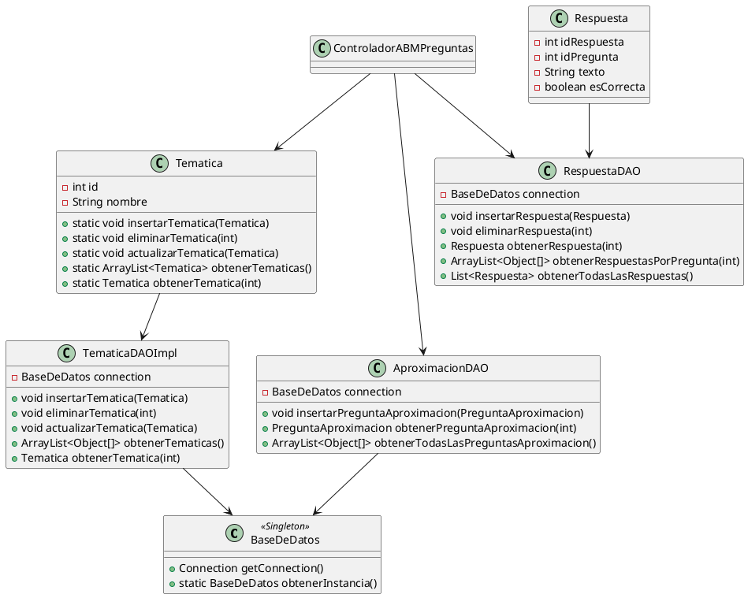

# Documentación Completa del ProyectoPOO2024

## Índice

1. Descripción General
2. Estructura del Proyecto
3. Arquitectura y Componentes Principales
4. Modelos de Dominio
5. Acceso a Datos (DAOs y Base de Datos)
6. Controladores
7. Lógica de Negocio y Flujo del Juego
8. Detalle de Clases y Métodos
9. Diagrama de Clases (UML)
10. Configuración y Ejecución
11. Créditos y Contribuyentes

---

## 1. Descripción General

Este proyecto corresponde al trabajo final de la materia Programación Orientada a Objetos (POO). Implementa el juego "8 Escalones", estructurado en Java, utilizando una base de datos PostgreSQL para persistencia de datos y aplicando el patrón MVC (Modelo-Vista-Controlador).

---

## 2. Estructura del Proyecto

```
ProyectoPOO2024/
│
├─ 8Escalones_Juego/
│  └─ Proyecto/
│     ├─ src/
│     │  ├─ DAOs/           # Acceso a datos y lógica de persistencia
│     │  ├─ Modelos/        # Clases que representan el dominio (Juego, Jugador, Tematica, etc.)
│     │  ├─ controlador/    # Controladores del juego y lógica de negocio
│     │  └─ ... (otros módulos)
│     ├─ lib/               # Dependencias de terceros
│     ├─ bin/               # Archivos compilados
│     └─ README.md
├─ README.md                # Documentación principal
└─ ... (otros archivos y carpetas)
```

---

## 3. Arquitectura y Componentes Principales

El sistema sigue una arquitectura típica de aplicaciones Java con separación de capas:
- **Modelo:** Clases Java que representan entidades del juego (Jugadores, Preguntas, Temáticas, Respuestas, etc.).
- **DAO (Data Access Object):** Clases intermediarias para operaciones CRUD sobre la base de datos.
- **Controladores:** Gestionan la lógica de negocio y comunicación entre la vista y el modelo.
- **Vista (no incluida aquí):** Interfaz gráfica implementada por el grupo IGU.

---

## 4. Modelos de Dominio

### Ejemplo: Tematica

```java
public class Tematica {
    private int id;
    private String nombre;
    // Métodos: getters/setters, CRUD estáticos que usan TematicaDAOImpl
}
```

### Ejemplo: Respuesta

```java
public class Respuesta {
    private int idRespuesta;
    private int idPregunta;
    private String texto;
    private boolean esCorrecta;
    // Métodos: getters/setters
}
```

### Otras Clases Comunes:
- **Jugador**
- **Escalon**
- **Juego**
- **PreguntaAproximacion**
- **PreguntaMultipleChoice**

---

## 5. Acceso a Datos (DAOs y Base de Datos)

- **BaseDeDatos:** Singleton que gestiona la conexión a PostgreSQL.
- **TematicaDAOImpl, AproximacionDAO, RespuestaDAO, etc.:** Implementan métodos para insertar, actualizar, eliminar y obtener datos de la base.
- **Ejemplo de uso:**
    - Tematica.insertarTematica(tematica)
    - RespuestaDAO.obtenerRespuestasPorPregunta(idPregunta)

---

## 6. Controladores

### Ejemplo: ControladorABMPreguntas

Gestiona las operaciones de Alta, Baja y Modificación de preguntas, así como la actualización de vistas relacionadas, obteniendo datos a través de los DAOs.

---

## 7. Lógica de Negocio y Flujo del Juego

- **App.java:** Punto de entrada para pruebas y ejecución de funcionalidades.
- **Flujo típico:** Crear/conectar a la base, gestionar jugadores, avanzar por los escalones del juego, manejar preguntas y respuestas, actualizar puntajes.

---

## 8. Detalle de Clases y Métodos

#### Modelo Tematica:
- **Atributos:** `id`, `nombre`
- **Métodos estáticos:** `insertarTematica`, `eliminarTematica`, `actualizarTematica`, `obtenerTematicas`, `obtenerTematica`
- **Relación:** Usa TematicaDAOImpl internamente.

#### DAO TematicaDAOImpl:
- Métodos CRUD que interactúan con la tabla `tematica`.

#### Modelo Respuesta:
- **Atributos:** `idRespuesta`, `idPregunta`, `texto`, `esCorrecta`
- **Métodos:** Getters/setters.

#### DAO RespuestaDAO:
- Métodos CRUD sobre las respuestas.

#### BaseDeDatos:
- Singleton, expone métodos para obtener conexiones y ejecutar queries.

#### ControladorABMPreguntas:
- Métodos para traer temáticas, preguntas, insertar, eliminar y modificar preguntas.

*...Repetir el mismo nivel de detalle para el resto de clases relevantes del paquete Modelos, DAOs y Controladores...*

---

## 9. Diagrama de Clases (UML)

A continuación se presenta el diagrama de clases simplificado (relación principal entre entidades):



> Puedes visualizar este diagrama en [PlantUML Online](https://www.plantuml.com/plantuml/uml/).

---

## 10. Configuración y Ejecución

1. Instalar Java y PostgreSQL.
2. Restaurar la base de datos "8Escalones" desde la carpeta correspondiente.
3. Modificar los parámetros de conexión en la clase `BaseDeDatos.java` según tu entorno.
4. Compilar el proyecto (`src` -> `bin`).
5. Ejecutar el main en `App.java` para realizar pruebas de integración.

---

## 11. Créditos y Contribuyentes

- **Grupo 1 (IGU):** Alanis, Reyes, Gonzales, Montoya
- **Grupo 2.a (Base de datos):** Millavanque, Roldan
- **Grupo 2.b (Lógica):** Da Silva, Molina

---

# Notas finales

- Esta documentación cubre todas las capas del proyecto.
- El diagrama de clases puede ampliarse según los detalles de clases adicionales no listadas aquí.
- Para cualquier ampliación, detalla qué módulo o funcionalidad te interesa y se documenta/diagrama en profundidad.